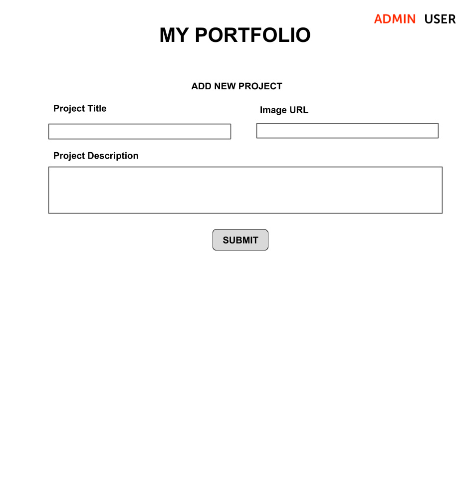
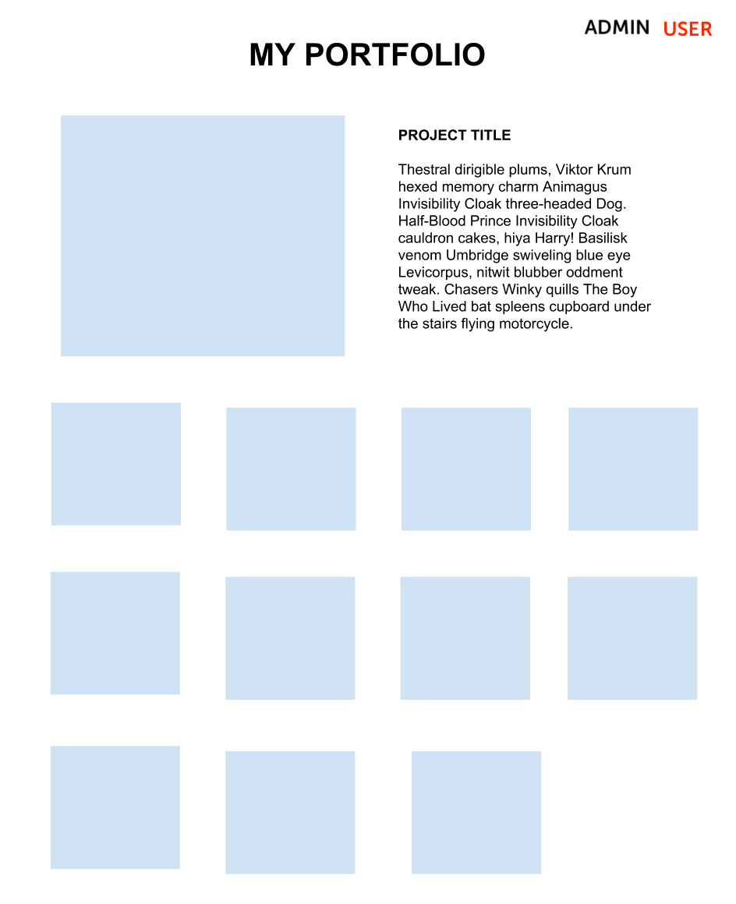

# Vue

En este repositorio usarás Vue para construir una aplicación de una sola página (_single page application_).

## Objetivos

- Usar componentes de Vue para construir portafolio web.
- Pasar _props_ a _child components_ y propagar los cambios hacia _parent components_.
- Usar _state_ para responder a cambios.

## Configuración y ejecución

1. Ejecuta `npm install` para instalar los paquetes.
1. Ejecuta `npm run dev` para ejecutar el servidor de desarrollo
1. En tu navegador ve a: `http://localhost:5050`.

## Requisitos básicos

### 1. Añade dos vistas - una vista "User" para el usuario y otra "Admin"

- [ ] Agrega funcionalidad.
  - Al hacer click en "Admin" deberíamos ir a la vista de "Admin", y al hacer click en "User" deberíamos mostrar la vista de usuario. Lo hemos comenzado por ti: solo tienes que entender cómo funciona y cómo se han conectado los componentes.
- [ ] Agrega estilos.
  - Debe quedar claro en qué página se encuentra el usuario. Para mostrarlo, agrega estilos condicionales al botón.

### 2. Vista "Admin" - crea un formulario y agrega imágenes a la página.

- [ ] Agrega funcionalidad.
  - Este formulario debería aceptar una URL, una descripción y un título.
  - Este formulario debería tener un botón "Submit".
  - Al hacer click en el botón, la imagen debería aparecer en la vista "User".
- [ ] Agrega estilos.
  - Todo debe estar alineado al centro. Mira el diseño adjunto.

### 3. Vista "User" - muestra las imágenes de todos los proyectos y actualiza el proyecto destacado cuando se haga click encima

- [ ] Agrega funcionalidad
  - Agrega al menos 3 proyectos por defecto.
  - Agrega un _event listener_ en cada elemento imagen de tu página. Cuando la imagen sea clicada, debería reemplazar el proyecto destacado en la parte superior de la página.
  - Hacer click en otras imágenes debería sustituir el proyecto destacado por el proyecto en el que se ha hecho click.
  - El proyecto destacado debería contener la imagen, título y descripción.
  - Usa el primer proyecto como proyecto destacado por defecto.
- [ ] Agrega estilos.
  - Todas las imágenes deberían tener el mismo ancho, con _padding_ en medio.
  - Las imágenes deben estar colocadas dentro de una cuadrícula (_grid_) para que aparezcan de cuatro en cuatro cuando el navegador tenga la medida máxima (pero debería ser _responsive_ - deben aparecer menos elementos si la ventana del navegador se hace más pequeña).
  - La imagen destacada debe aparecer a la izquierda, el título y la descripción, a la derecha.

### 4. Mejora los estilos.

- [ ] ¡Juega con los estilos para darle un aspecto lo más profesional posible!

## Recursos

- [Vue docs - single file components](https://vuejs.org/guide/scaling-up/sfc.html)
- [Vue docs - components](https://vuejs.org/guide/essentials/component-basics.html)

## Notas

_Este es un proyecto de estudiante creado en [CodeOp](http://CodeOp.tech), un bootcamp de desarrollo full stack en Barcelona._
